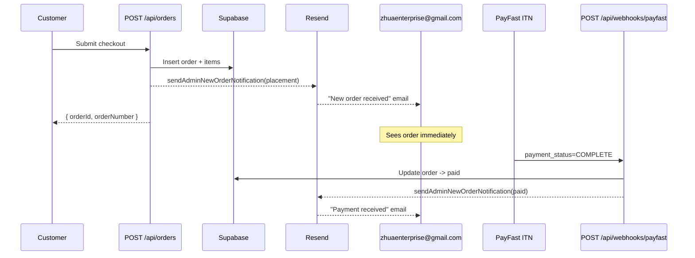
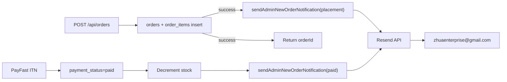

## Plan: Admin order-placement email

**TL;DR**
Introduce a new `sendAdminNewOrderNotification` helper in `src/lib/order-notifications.ts` (re-using the same Resend client + branded HTML shell used for customer status emails). Fire it from the order-insert path in `src/app/api/orders/route.ts` so the admin receives a notification the moment a customer places an order, and again from the PayFast webhook (`src/app/api/webhooks/payfast/route.ts`) when payment transitions to `paid`. Admin recipient comes from a new `ADMIN_NOTIFICATION_EMAIL` env var with `zhuaenterprise@gmail.com` as the safe default.

**Steps**

1. **Add admin recipient + add `hasResendEnv` helper checks (already exists).** In `src/lib/supabase/env.ts` add `ADMIN_NOTIFICATION_EMAIL` along with `getAdminNotificationEmail()` that returns the env value or falls back to `'zhuaenterprise@gmail.com'`. Add a `hasAdminNotificationEmail` flag only if useful; otherwise the getter can just return the default. (depends on nothing)
2. **Extend `src/lib/order-notifications.ts`.** Add `AdminNewOrderNotificationInput` type covering: `orderNumber`, `customerName`, `customerEmail`, `customerPhone`, `address`, `city`, `province`, `postalCode`, `deliveryType`, `paymentMethod`, `paymentStatus`, `totalCents`, `subtotalCents` (recompute from items), `deliveryFeeCents`, `promoCode`, `discountCents`, `items: { productName; quantity; unitPriceCents; selectedColor?; selectedSize?; selectedFabric?; customNote? }[]`. Export `sendAdminNewOrderNotification(input)` that:
   - Guards on `resendClient`.
   - Builds a separate `adminOrderCopy` map with two variants: `placement` ("New Zhua Furnitures order received — #...") and `paid` ("Payment received for Zhua Furnitures order #...").
   - Renders a branded summary table with order/customer/delivery/items/totals. Reuse the same dark-gold HTML shell (`#163250` panel, `#b59241` accent) already used by customer notifications — keep `escapeHtml` and `formatCents` reuse.
   - Sends to `getAdminNotificationEmail()` via Resend with reply-to set to the customer's email so the admin can reply directly. Wraps the await in a try/catch and logs the failure — same shape as the existing `console.error('[Admin Order Update] Failed to send order status email.', ...)` block. (depends on 1)
3. **Fire on order placement.** In `src/app/api/orders/route.ts`, immediately after the `orders` insert + `order_items` insert succeed (around the existing `await logUserActivity` block, ~line 331), call `sendAdminNewOrderNotification({...})` inside a `try/catch` that logs on failure but does **not** fail the request (order placement should never break because email failed). Pass `paymentStatus: 'awaiting_payment'` and `event: 'placement'`. (depends on 2)
4. **Fire on PayFast payment confirmation.** In `src/app/api/webhooks/payfast/route.ts`, inside the existing `if (isFirstPaidTransition)` branch (just after the `applyPaidOrderStockDecrement` call), call `sendAdminNewOrderNotification({...paymentStatus: 'paid', event: 'paid'})`. Reuse the loaded `order` row + fetch `order_items` for the email body. Same try/catch + log pattern; never block the webhook response on email failure. (depends on 2, parallel with 3)
5. **Register env var.** Add `ADMIN_NOTIFICATION_EMAIL` to `README.md` / `env.example` / setup docs alongside `RESEND_*`. Document the default behaviour in a short comment in `env.ts`. (depends on 1)
6. **Manual verification.** Place a test order via the storefront using PayFast sandbox, confirm:
   - Admin (`zhuaenterprise@gmail.com`) receives the placement email within seconds.
   - On PayFast ITN completion, a second "Payment received" email arrives.
   - Customer still receives their existing confirmation flow unchanged.
   - Email failure does not roll back order creation or webhook success.

**Relevant files**
- `src/lib/order-notifications.ts` — add `sendAdminNewOrderNotification` + HTML builder.
- `src/lib/supabase/env.ts` — add `ADMIN_NOTIFICATION_EMAIL` accessor.
- `src/app/api/orders/route.ts` — call notification after order/items insert.
- `src/app/api/webhooks/payfast/route.ts` — call notification inside `isFirstPaidTransition` branch.
- `.env.local` / env example / README — document the new variable.

**Diagrams**

**Verification**
1. With `RESEND_API_KEY` and `RESEND_FROM_EMAIL` set, run `pnpm dev`, place a PayFast-sandbox order → confirm two emails land at `zhuaenterprise@gmail.com` (placement + paid) and the customer still receives their original confirmation.
2. Temporarily set `RESEND_API_KEY=""` and confirm order placement + payment still succeed (errors only logged, never thrown to caller).
3. Override via `ADMIN_NOTIFICATION_EMAIL` env to a personal Gmail and confirm the override takes effect.
